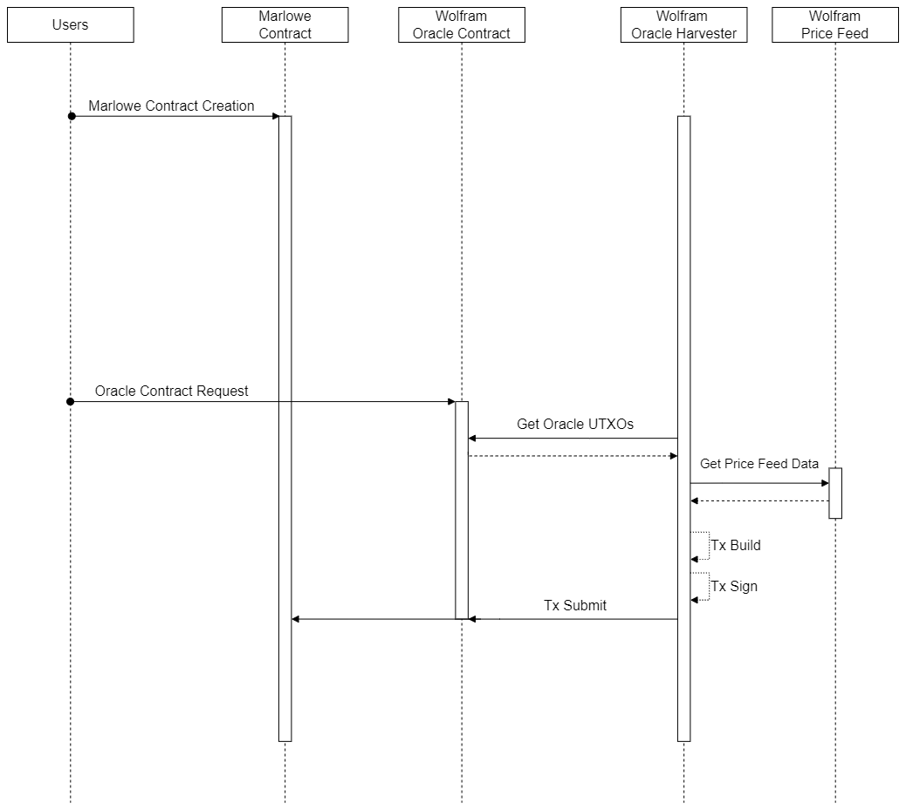
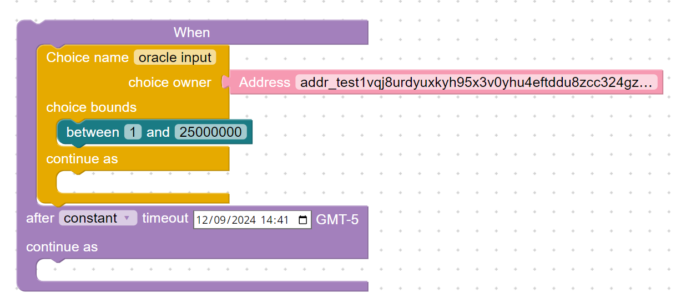

# Milestone Three

## Introduction
The notebook shows the complete operation of the Wolfram Marlowe Smart Contract Execution components. The notebook presents a real use case and reviews both Marlowe and the Wolfram Oracle contract and the constraints imposed for its proper operation.

## Interactions diagram



## Oracle constraints

### Marlowe contract
When defining a Wolfram Oracle input in the Marlowe contract, follow these steps:

* Instantiate a choice.

* Specify the name of the choice.

* Assign ownership to the Oracle Signing Address.

* Set reasonable boundaries for the input.

* Include an additional input to serve as the continuation of the choice.

The last restriction ensures the Marlowe and Oracle contracts can run simultaneously, while the Marlowe validator prevents payouts in multi-contract transactions to avoid double satisfaction attacks.




### Oracle contract

When creating a request for the oracle service, the following steps are required:

* Progress the Marlowe contract until the oracle input is needed.

* Deploy a UTXO to the Oracle Contract Address, containing the following elements:

    * Payment for the service.
    
    * A datum with the necessary structure.
    
    ```json
    oracleDatum = {
           "marloweContract" :: TxId,
           "marloweIndex" :: Integer,
           "transactionId" :: TxId,
           "transactionIndex" :: Integer,
           "choiceToSolve" :: BuiltinByteString,
           "dataTag" :: BuiltinByteString,
           "deadline":: POSIXTime,
           "beneficiaryAfterDeadline":: PubKeyHash
    }
    ```

### Oracle information
To use the oracle through their steps, the user must have this information available 

* Oracle Signing Address: `addr_test1vqj8urdyuxkyh95x3v0yhu4eftddu8zcc324gzw396c28vgcwyugr`
* Oracle Contract Address: `addr_test1wrs08u8kuqwnse0ahjdjr9ffq20d9vycwy4ns8re2y8sangc8djyc`
* Oracle Contract Reference Script:

```json
{
    "transactionId":"64546010fe2c9745a48087413a81bedd63e9b9c1c97914d6b39fb0690d812483",
    "index":0
}
```

The `Oracle Contract Reference Script` is required if the Oracle Contract reaches its deadline. For further details about the Wolfram Oracle Contract, please refer to the [Milestone One](https://github.com/WolframBlockchainLabs/MarloweSC-Execution/blob/106df96739fe7dd955bc101e0c58929414768f77/MilestoneOne/WolframOracleContract.ipynb) of this proposal.

## Demonstration case

Check the [milestone notebook](MilestoneThree\TestServiceUsingMarlowe.ipynb).
