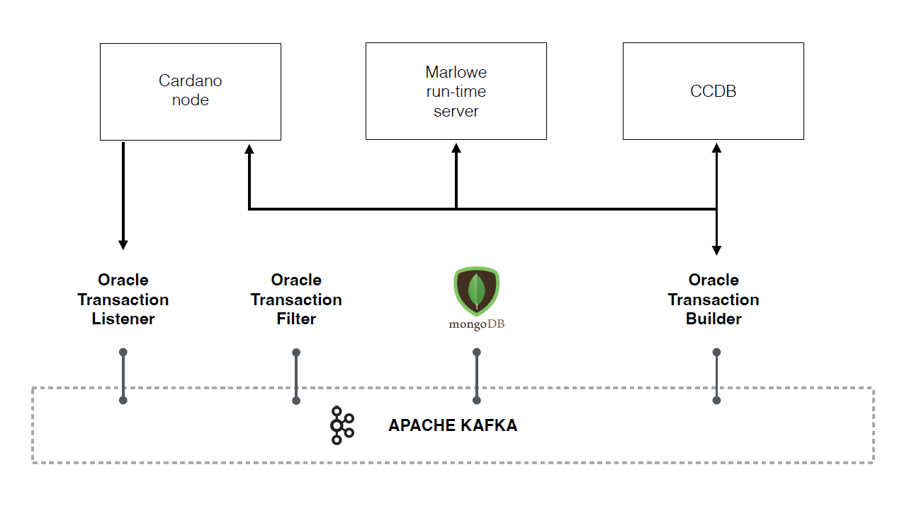

# Milestone Two

## Introduction
This milestone showcases the functionality of the harvester service in monitoring the Oracle validator address and recovering information attached to it. It also demonstrates the effectiveness of the transaction builder system created to address the data requests collected.

## Harvester components
The principal components for the service are:

* Oracle Transaction Listener: Real-time chain indexer
* Oracle Transaction Filter: Indexer for the oracle validator address
* Oracle Transaction Builder: Transaction creation component

These backend relies on:

* Cardano node: To connect to Cardano network
* Marlowe Runtime Server: To discover information about Marlowe
* Cryptocurrency Database: Based on the [Wolfram Price Feed Infrastructure](https://github.com/WolframBlockchainLabs/WolframPriceFeedInfrastructure/tree/main) (CCDB)
* MongoDB Database: For persistent storage
* Apache Kafka: Event streaming platform to facilitate communication between components 

The interactions are shown here:
